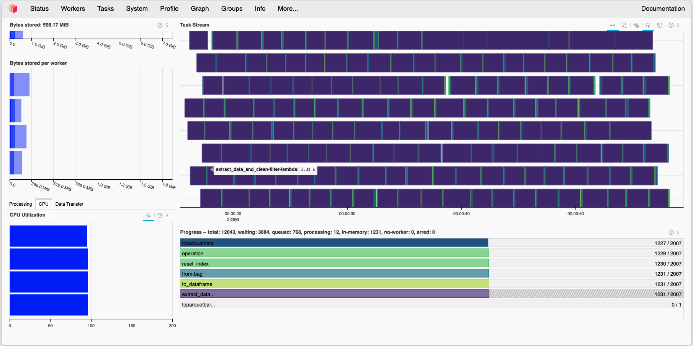

# 🦠 Préparation de Corpus LLM - CORD-19 avec Dask


> **Projet Big Data** : Comment peut-on créer un corpus d’apprentissage exploitable par des LLM en traitant et préparant à grande échelle des données textuelles brutes ?

## 💾 Données

Le dataset utilisé est une version modifiée du CORD-19 (>20 Go). Pour reproduire ce projet, vous devez télécharger les données séparément.

👉 **[TÉLÉCHARGER LE DATASET ICI (Kaggle)](https://www.kaggle.com/datasets/souleimaneelqodsi/cord19-edited)**

**Instruction :**
1. Téléchargez le dataset via le lien ci-dessus.
2. Décompressez-le sur votre machine.
3. Notez le chemin du dossier contenant les fichiers `.json`.
4. Configurez ce chemin dans le script `demo_dask.py` (voir INSTALL.txt).

## 📋 À propos du projet

Ce projet a été réalisé dans le cadre du module **Big Data M1 MIAGE**. Il démontre l'efficacité de l'architecture distribuée **Dask** pour traiter le dataset **CORD-19** (COVID-19 Open Research Dataset).

L'objectif est de simuler un pipeline industriel de prétraitement NLP (Natural Language Processing) capable de :
* Ingérer **~400 000 fichiers JSON** hétérogènes.
* Nettoyer le texte (Regex, normalisation, suppression PII).
* Filtrer les données non pertinentes.
* Exporter le résultat en format **Parquet** compressé.

## 🏗 Architecture du Pipeline

Le pipeline utilise une approche **ETL (Extract, Transform, Load)** distribuée :

```mermaid
graph LR
A["JSON Bruts (40GB)"] -->|Dask Bag| B("Lecture Distribuée")
B -->|Map| C{"Nettoyage & Extraction"}
C -->|Filter| D["Filtrage Qualité"]
D -->|"Dask DataFrame"| E["Ecriture Streaming"]
E -->|PyArrow| F["Resultat.parquet (64MB)"]
````

  * **Ingestion** : Lecture par lots (`partition_size=200`) pour éviter l'OOM (Out Of Memory).
  * **Traitement** : Utilisation de tous les cœurs CPU via `LocalCluster`.
  * **Stockage** : Conversion JSON verbeux -\> Parquet colonnaire (Compression Snappy).

## 🚀 Performances & Résultats

Comparatif effectué sur l'intégralité du dataset (401 214 documents) :

| Métrique | Pandas (Estimé) | Dask (Réel) | Gain |
| :--- | :--- | :--- | :--- |
| **Temps de traitement** | \~4 heures | **\~7 minutes** | **x34** ⚡️ |
| **Mémoire (RAM)** | Crash (OOM \> 16Go) | **Stable (\~600 Mo)** | **Infini** (Faisabilité) |
| **Stockage Sortie** | N/A | **64 Mo (Parquet)** | **-99%** (vs JSON) |

*Aperçu du Dashboard Dask montrant l'utilisation parallèle des cœurs M1.*



## 🛠 Installation et Utilisation

Ce projet nécessite un environnement Python configuré spécifiquement pour le calcul distribué.

👉 **[VOIR LE FICHIER INSTALL.txt](./INSTALL.txt) POUR LES INSTRUCTIONS DÉTAILLÉES.**

### Démarrage rapide

Une fois l'environnement installé (voir lien ci-dessus) :

1.  **Lancer le cluster et le traitement :**
    ```bash
    python demo_dask.py
    ```
2.  **Analyser les résultats :**
    Ouvrez le notebook Jupyter pour explorer les données nettoyées :
    ```bash
    jupyter notebook demo_dsidbd.ipynb
    ```

## 📂 Structure du Répertoire

```bash
.
├── demo_dask.py                # Script ETL principal (Cluster Dask)
├── demo_dsidbd.ipynb        # Présentation, Benchmark et Analyse des résultats
├── INSTALL.txt                 # Guide d'installation pas-à-pas
├── dashboard_screenshot.png         # Capture d'écran du monitoring
├── README.md                   # Documentation du projet
└── resultats_nettoyage.parquet # (Généré) Dossier contenant le corpus final
```

## 👥 Auteurs

Projet réalisé par les étudiants du Master 1 MIAGE Informatique Décisionnelle :

  * **Souleimane EL QODSI**
  * **Asma AZRI**
  * **Lucas PANTANELLA** 
-----

*Université Paris-Saclay - Décembre 2025*
